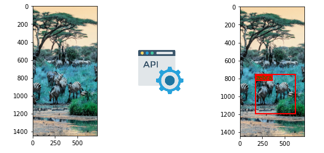

# Anivision API
Welcome to Anivision Api , [this](https://anivision-backend.herokuapp.com/ "hosted api link") api is made on fastapi (python) and take input image in __base64__ encoding in json format. It gives the bounding box location and name of the animal. There are 398 species and sub-species in total. 

### Input format

```json
{
  "img_base64": "/9j/4AA..." //string format
}
```

### Output format

```json
{
  "result":[
            "animal name",            //string
            "center at x axis",       //float ex 0.5 relative to image
            "center at y axis",       //float 
            "width of bounding box",  //float
            "height of bounding box"  //float
          ]
}
```
---
## Python code for trying:
```python 
import requests
import base64
import json 

reqUrl = "https://anivision-backend.herokuapp.com/"

headersList = {
 "Accept": "*/*",
 "Content-Type": "application/json" 
}

with open('785432.jpg','rb') as file:
    image_binary=file.read()

image_base64=base64.b64encode(image_binary)

payload = json.dumps({
  "img_base64": image_base64.decode()
})

response = requests.request("POST", reqUrl, data=payload,  headers=headersList)

print(response.text)
```


---
